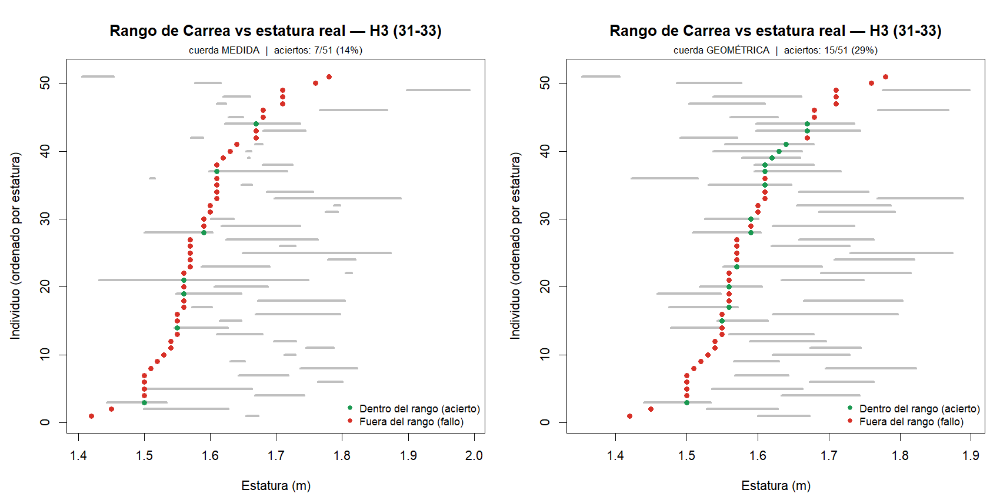
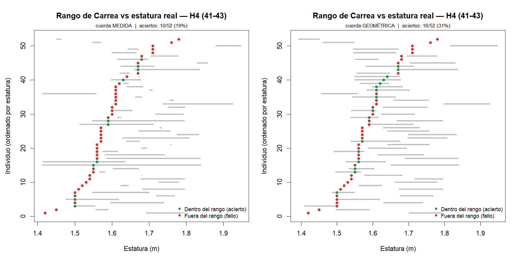
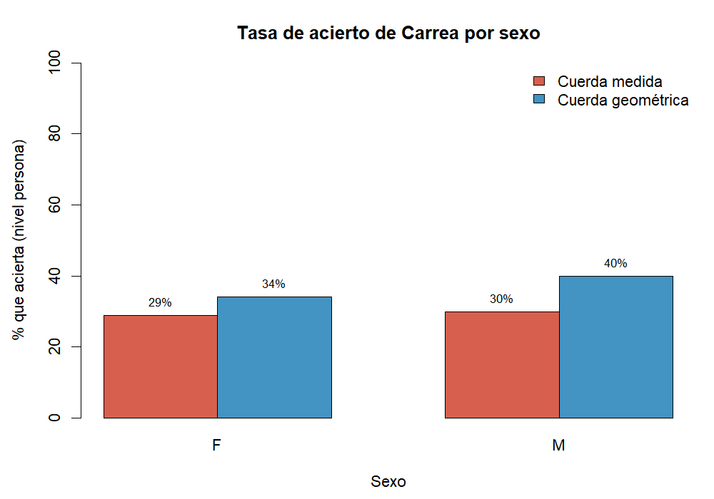
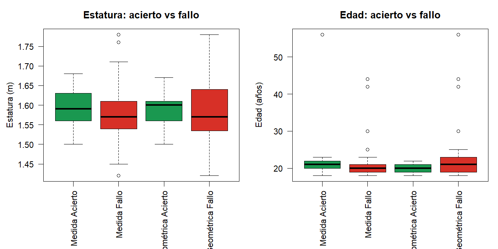

# Interpretación de la unión de datos y del análisis de Carrea

**Proyecto de Servicio Social — Cortés Silva Edson André, Facultad de Ciencias, UNAM.**
Validación del método odontométrico de Carrea para estimar la estatura en población
mexicana. Documento generado a partir de la base unificada
`resultados/datos_unidos_corregido.csv` y de las salidas del pipeline.

---

## 1. Objetivo de este documento

Explicar, con detalle y de forma reproducible:

1. **Cómo se resolvieron los registros con código de catálogo compartido** entre las
   dos fuentes, distinguiendo los que son **la misma persona** de los que son
   **demografías distintas** (personas diferentes que coinciden en el código).
2. **Cómo se recuperaron e integraron** al análisis los individuos de demografía
   distinta, asignándoles un **código nuevo de 4 dígitos**, en lugar de eliminarlos.
3. **Qué dicen los resultados** del análisis sobre la validez del método de Carrea
   en esta muestra.

---

## 2. Fuentes de datos

| Fuente | Archivo | Contenido |
|---|---|---|
| **A** — base de 41 | `data/Mediciones_Estatura.csv` | 41 individuos, 1 observación (vernier), con demografía propia. |
| **B** — base de 13 | `data/datos_limpios_validados.csv` | 13 individuos con réplicas (obs. 1 y 2) que se **promedian**. |
| **C** — demografía de B | `data/Datos_Estatura.csv` | Edad, sexo, estatura y origen de los 13 de la base validada. |

En **ambas** fuentes la columna `ID` es el **código de catálogo del modelo**
odontológico (no un identificador secuencial). Por eso el cruce por `ID` compara
identidades de catálogo, pero **compartir código no garantiza que sea la misma
persona**: un código puede haberse reutilizado o transcrito mal.

Filtros aplicados antes de unir: `Evaluador == 1` e instrumento vernier (el typo
`"Verniere"` del archivo original se normaliza a `"Vernier"`). La base B se promedia
entre sus dos observaciones por modelo.

---

## 3. El problema: ¿duplicado o persona distinta?

Cinco códigos aparecen en ambas fuentes: **3, 14, 18, 27 y 71**.

La versión previa del pipeline **eliminaba en bloque** las cinco filas de la base de
41, tratándolas a todas como duplicados del registro validado. Esto era incorrecto:
en 4 de los 5 casos las dos filas tienen **demografías contradictorias** (el sexo
incluso se invierte en los códigos 18 y 71), es decir, **son personas distintas** que
casualmente comparten el código de catálogo. Eliminarlas perdía 4 individuos reales.

### Criterio de validación

Para cada código compartido se comparan las dos demografías con una regla explícita
y parametrizable (tolerancia de estatura `TOL_EST = 0.02 m`):

- **MISMA_PERSONA** → mismo sexo **y** `|Δestatura| ≤ 0.02 m`.
  Es un duplicado real del mismo individuo. Se conserva el registro **validado** (base
  de 13: réplicas promediadas + demografía dedicada) y se **consolida** el duplicado
  para no contar dos veces a la misma persona.
- **DEMOGRAFIA_DISTINTA** → el sexo difiere **o** `|Δestatura| > 0.02 m`.
  No es la misma persona. **No se elimina**: se le asigna un **código nuevo de 4
  dígitos** (`9000 + código original`) y se integra al análisis como individuo propio.

Las filas `"sin codigo"` no tienen llave de identidad, por lo que nunca se consideran
duplicados.

### Resultado de la validación

| Código | Sexo A→B | Estatura A→B | Edad A→B | Origen A→B | Veredicto | Código nuevo |
|---|---|---|---|---|---|---|
| **3**  | F → F | 1.67 → 1.67 | 25 → 25 | CDMX → CDMX | **Misma persona** | — (consolidado) |
| **14** | F → F | 1.42 → 1.50 | 20 → 20 | CDMX → Edo. Méx. | Demografía distinta | **9014** |
| **18** | **F → M** | 1.57 → 1.61 | 20 → 21 | Edo. Méx. → Edo. Méx. | Demografía distinta | **9018** |
| **27** | F → F | 1.54 → 1.57 | **18 → 30** | Edo. Méx. → CDMX | Demografía distinta | **9027** |
| **71** | **M → F** | 1.55 → 1.52 | 18 → 19 | CDMX → CDMX | Demografía distinta | **9071** |

> **Nota sobre el "ID 13".** El único registro que resulta ser **la misma persona** es
> el código **3** (demografía idéntica en ambas fuentes), no el 13. En la base de 41 el
> código 13 corresponde a un individuo único que no aparece en la base validada, de
> modo que **no es un duplicado**. La clasificación anterior se desprende directamente
> de los datos (ver `resultados/auditoria_union_demografias.csv`).

### Efecto sobre el tamaño de muestra

```
Códigos compartidos: 5
  → misma persona (consolidado):                 1   (código 3)
  → demografías distintas (recuperadas 9xxx):    4   (9014, 9018, 9027, 9071)

Base unificada final: 53 individuos
  13 validados + 36 propios de la base de 41 + 4 recuperados
  Estatura conocida: 53 / 53   |   Sexo: 43 F, 10 M
```

La versión previa producía **49** individuos (perdía los 4 recuperados); la versión
corregida produce **53**. Cada registro recuperado conserva, además del nuevo `ID`, su
`codigo_original` y una `clasificacion_union` que documenta su procedencia, de modo que
la decisión es totalmente trazable.

**Archivos generados por la unión**

- `resultados/datos_unidos_corregido.csv` — base unificada (53 individuos) con columnas
  `ID`, `codigo_original`, `clasificacion_union` y las medidas dentales.
- `resultados/auditoria_union_demografias.csv` — una fila por código compartido con su
  veredicto y la comparación demográfica entre fuentes.
- Figuras `reporte/figuras/union_*.png` (distribución por sexo, composición fuente×sexo
  y auditoría de la unión por código).

---

## 4. Interpretación del análisis sobre la base corregida

Todos los resultados que siguen se calculan sobre los **53 individuos** (las
hemiarcadas analizables, tras limpieza anatómica, son **H3 = 51** y **H4 = 52**). Los 4
individuos recuperados entran de forma natural en cada etapa gracias a sus códigos
`9xxx`.

### 4.1 Normalidad y dimorfismo sexual

- La estatura es compatible con normalidad (Shapiro-Wilk global `W = 0.972, p = 0.25`),
  tanto en hombres como en mujeres.
- **El sexo es el único predictor con poder real.** Diferencia de medias
  F = 1.574 m vs M = 1.657 m → **8.3 cm** (`t = -3.17, p = 0.008`; Spearman
  `ρ = 0.417, p = 0.002`). En las regresiones `estatura ~ arco + sexo`, el **sexo es
  significativo** (`p < 0.001`) mientras que **el arco dental no aporta** (`p ≈ 0.6–0.99`).

### 4.2 La cuerda medida es geométricamente inconsistente

- Correlación arco–cuerda medida: H3 `r = 0.64`, H4 `r = 0.49` (significativas), pero
  el **cociente cuerda/arco ≈ 0.98**, es decir, la cuerda medida es casi igual al arco.
- En **~40 % de los casos la cuerda medida supera al arco** (H3: 20/51; H4: 21/52), lo
  cual es **imposible** (una cuerda no puede ser más larga que su arco) y vuelve
  intercambiables `Tmin` y `Tmax`. Esto evidencia un problema en la **medición** de la
  cuerda, no en la biología.

### 4.3 El método de Carrea no predice la estatura

- Con el modelo original (`k = 30π`, cuerda medida), la **precisión del rango**
  `[Tmin, Tmax]` es baja: **H3 ≈ 13.7 %**, **H4 ≈ 19.2 %**.
- La correlación entre la estatura estimada por Carrea (punto medio del rango) y la
  estatura **real es nula** (`r ≈ 0`: H3 −0.05, H4 +0.01). El método **no ordena** a los
  individuos por estatura. Ver `reporte/figuras/etapa3_carrea_real_*.png` (hallazgo
  central).

### 4.4 La cuerda geométrica corrige la geometría, no la capacidad predictiva

Derivando la cuerda de un **modelo de arco circular** (a partir del arco total y la
distancia intercanina) en lugar de medirla:

- **Elimina los casos imposibles** (cuerda < arco siempre; imposibles: 0).
- **Duplica la precisión** del rango: H3 13.7 % → **29.4 %**; H4 19.2 % → **30.8 %**.
- Pero la **correlación con la estatura real sigue siendo nula**: corrige el defecto
  geométrico del método, **no** le da poder predictivo.

### 4.5 Los "aciertos" del modelo original son un artefacto de medición

- Aciertos: H3 7/51 (13.7 %), H4 10/52 (19.2 %); la mayoría de los fallos caen **por
  debajo** de `Tmin`.
- Lo que distingue a un acierto **no es un rasgo biológico** (estatura y sexo casi no
  difieren entre aciertos y fallos), sino un **cociente cuerda/arco medido más bajo**
  (H3: 0.954 vs 0.984; H4: 0.918 vs 0.981). Una cuerda medida más corta abre un rango
  más ancho hacia abajo y "atrapa" la estatura real.
- La regresión logística lo confirma: el **cociente cuerda/arco** predice el acierto
  (`β ≈ −15.9, p = 0.003`), mientras que estatura y sexo **no**. Como ese cociente está
  dominado por el **error de medición** de la cuerda, **acertar con el modelo original
  es esencialmente un artefacto de medición, no una propiedad del individuo**.

### 4.6 Comparación visual del rango: cuerda medida vs cuerda geométrica

Para ver el efecto de cambiar de cuerda **individuo a individuo**, se grafica el rango
de Carrea `[Tmin, Tmax]` (segmento gris) frente a la estatura real (punto), ordenando a
las personas por estatura. Verde = la estatura cae dentro del rango (acierto); rojo =
fuera (fallo). Cada figura muestra, lado a lado, el modelo con la **cuerda medida** (tal
como viene en los datos) y con la **cuerda geométrica** (calculada). Los rangos y
aciertos se toman directamente de `resultados/estimaciones_cuerda_geometrica.csv`.





**Lectura de las figuras:**

| Hemiarcada | n | Aciertos cuerda medida | Aciertos cuerda geométrica |
|---|---|---|---|
| H3 (31–33) | 51 | 7 (13.7 %) | 15 (29.4 %) |
| H4 (41–43) | 52 | 10 (19.2 %) | 16 (30.8 %) |

- Con la **cuerda medida** los segmentos son **estrechos** (porque la cuerda ≈ arco) y
  quedan casi siempre **por encima** de la estatura real: la mayoría de los puntos son
  rojos y caen por debajo del rango.
- Con la **cuerda geométrica** los segmentos son **más anchos** y se desplazan hacia
  abajo (la cuerda calculada es siempre menor que el arco), de modo que el rango
  "atrapa" más estaturas: el número de puntos verdes **aproximadamente se duplica**.
- Sin embargo, en ambos paneles los puntos verdes y rojos **no se separan por estatura**
  (no hay una franja de aciertos en un extremo del eje): el rango se ensancha de forma
  pareja para todos, sin **ordenar** a los individuos según su talla. Es la confirmación
  visual de §4.3–4.4: la cuerda geométrica mejora la **cobertura** del rango, pero **no**
  la **capacidad predictiva** del método (`r ≈ 0`).

> Figuras producidas por `Analisis_aciertos.R`
> (`reporte/figuras/aciertos_bracket_H3_comparacion.png` y `…_H4_comparacion.png`).

### 4.7 ¿Hay un perfil demográfico de los aciertos? (medida vs geométrica)

Se comparan las características **demográficas** (sexo, edad, estatura, lugar de origen)
de quienes aciertan frente a quienes fallan, para los **dos** modelos (cuerda medida y
geométrica). El análisis se hace por hemiarcada (H3, H4) y a nivel **persona** (acierta
si su estatura cae en el rango en al menos una hemiarcada); el origen se normaliza
(`CDMX` y `Ciudad de México` son el mismo lugar). Script: `Analisis_demografico_aciertos.R`.






**Resumen a nivel persona (n = 48):**

| Rasgo | Medida — Acierto (14) | Medida — Fallo (34) | Geom. — Acierto (17) | Geom. — Fallo (31) |
|---|---|---|---|---|
| Sexo (% F) | 79 % | 79 % | 76 % | 81 % |
| Edad (mediana) | 21 | 20 | 20 | 21 |
| Edad (media ± sd) | 23.1 ± 9.6 | 21.8 ± 6.2 | **19.7 ± 1.3** | **23.7 ± 8.8** |
| Estatura (m) | 1.591 | 1.590 | 1.594 | 1.588 |
| Origen (% CDMX) | 71 % | 62 % | 76 % | 58 % |

**Pruebas (p-value; Fisher para sexo/origen, Wilcoxon para edad/estatura):**

| Modelo / nivel | Sexo | Origen | Edad | Estatura |
|---|---|---|---|---|
| Medida — persona | 1.00 | 1.00 | 0.21 | 0.92 |
| Geométrica — H3 | 1.00 | 0.39 | 0.16 | 0.19 |
| Geométrica — H4 | 1.00 | 0.16 | **0.007** | 0.40 |
| Geométrica — persona | 0.73 | 0.29 | 0.07 | 0.45 |

**Lectura:**

- **Con la cuerda medida (modelo original) no hay perfil demográfico:** sexo, edad,
  estatura y origen son estadísticamente indistinguibles entre aciertos y fallos (todos
  los p > 0.2, la mayoría ≈ 1.0). El ~80 % de mujeres en ambos grupos solo refleja la
  composición de la muestra (81 % F).
- **Con la cuerda geométrica aparece una señal en la EDAD:** los aciertos son **más
  jóvenes y mucho más homogéneos** en edad (≈19–20 años, sd ≈ 1.3) que los fallos
  (mediana 21 pero con una cola de personas mayores, sd ≈ 8.8). El efecto es
  **significativo en H4** (Wilcoxon `p = 0.007`) y apunta en la misma dirección en H3
  (`p = 0.16`) y a nivel persona (`p = 0.07`). En la práctica, **todas las personas
  mayores de ~25 años quedan como fallos**: el rango geométrico (más ancho y centrado
  más abajo) "atrapa" bien a los adultos jóvenes de talla típica, pero no a los mayores.
- Sexo, estatura y origen **siguen sin diferenciar** aciertos de fallos en el modelo
  geométrico (todos los p > 0.15).

**Advertencias (por qué no sobreinterpretar la edad):**

1. **Muestra homogénea y grupos pequeños:** 81 % mujeres, mayoría 18–25 años, mayoría
   CDMX. Hay poca variación demográfica y solo ~4 personas mayores (30, 42, 44, 56
   años), así que el efecto de edad descansa en muy pocos individuos.
2. **Comparaciones múltiples:** se probaron 4 variables × 3 niveles × 2 modelos. Un
   único `p = 0.007` no sobrevive una corrección conservadora (Bonferroni ≈ 0.002), aunque
   la **consistencia de la dirección** (aciertos siempre más jóvenes con la cuerda
   geométrica) sugiere que no es puro ruido.
3. **Probablemente indirecto:** no hay una razón biológica para que la edad *per se*
   determine el acierto; es más plausible que refleje el mismo mecanismo geométrico
   (rango ancho hacia abajo) actuando sobre una muestra donde los mayores tienen tallas
   o arcos algo distintos. No implica poder predictivo del método.

En síntesis: **la demografía no explica el acierto bajo el modelo original**; bajo el
modelo geométrico emerge una **asociación débil con la edad** (aciertos más jóvenes),
que conviene señalar pero **no interpretar como validez del método** dada la potencia
limitada de la muestra.

---

## 5. Conclusiones

1. **No todos los códigos compartidos eran duplicados.** Solo el código 3 es la misma
   persona; los códigos 14, 18, 27 y 71 son **individuos distintos** que se recuperaron
   con códigos de 4 dígitos (9014, 9018, 9027, 9071) e ingresaron al análisis. La base
   pasó de 49 a **53 individuos**.
2. La recuperación de esos 4 individuos **no altera las conclusiones de fondo**, lo que
   refuerza su robustez: el método de Carrea **no predice la estatura** en esta muestra
   (`r ≈ 0`); el único predictor real es el **sexo** (~8 cm de dimorfismo).
3. La **cuerda geométrica** corrige la inconsistencia de la cuerda medida (elimina los
   casos imposibles y duplica la precisión del rango), pero **no** genera capacidad
   predictiva.
4. Los **aciertos** del modelo original responden al **error de medición** de la cuerda,
   no a un rasgo biológico del individuo.
5. **La demografía no perfila a los aciertos** bajo el modelo original (sexo, edad,
   estatura y origen indistinguibles). Con la cuerda geométrica surge una **asociación
   débil con la edad** (los aciertos son más jóvenes y homogéneos; `p = 0.007` en H4),
   probablemente indirecta y limitada por el tamaño de muestra; no debe leerse como
   validez predictiva del método.

---

## 6. Reproducibilidad

```r
# En R, desde la raíz del repositorio:
source("Union_limpieza.R")     # -> datos_unidos_corregido.csv + auditoria_union_demografias.csv
source("Cuerda_geometrica.R")  # -> estimaciones_cuerda_geometrica.csv
source("Analisis_aciertos.R")  # -> figuras de aciertos (bracket medida vs geométrica)
source("Analisis_demografico_aciertos.R")  # -> demografía de aciertos + figuras demo_aciertos_*
source("Etapa_3_corregido.R")  # -> resultados_carrea_corregido.csv
```

```bash
# Alternativa equivalente en Python (genera además caracteristicas_aciertos.md):
python pipeline_correccion.py
```

El parámetro de decisión de la unión es `TOL_EST = 0.02 m` (tolerancia de estatura
para considerar dos registros como la misma persona) y el esquema de recodificación es
`código_nuevo = 9000 + código_original`. Ambos están centralizados en
`Union_limpieza.R` (y su equivalente en `pipeline_correccion.py`).
